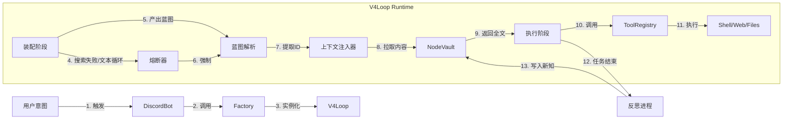

# Genesis V4 源码级深度解析与因果图谱 (The Deep Dive)

> **版本**: V4.2 (Glassbox)  
> **生成时间**: 2026-03-14  
> **定位**: "第二份说明书" — 专注于代码块内部逻辑、状态流转与因果联系。  
> **基准**: 100% 基于 `genesis/v4/loop.py`, `agent.py`, `manager.py`, `discord_bot.py` 源码。

---

## 一、核心引擎：V4Loop (`genesis/v4/loop.py`)

这是整个系统的“心脏”，控制着从用户输入到最终响应的每一步跳动。

### 1.1 类状态机变量 (State Variables)

| 变量名 | 初始值 | 含义与作用 | 变化因果 |
|---|---|---|---|
| `self.phase` | `"ASSEMBLY"` | 当前生命周期阶段 | 初始为装配；解析出 JSON 蓝图后变为 `"EXECUTION"`。 |
| `self.blueprint_shown` | `False` | 蓝图是否已向用户展示 | 防止在 EXECUTION 阶段重复渲染蓝图。 |
| `self.assembly_retries` | `0` | **[熔断计数器]** | 在 ASSEMBLY 阶段每收到一次无效非 JSON 响应加 1；调用搜索工具则清零。 |
| `self.active_node_ids` | `[]` | 当前激活的知识节点 | 从蓝图 JSON 的 `active_nodes` 解析而来，用于 Context Injection。 |
| `self.messages` | `[sys, user]` | 对话上下文堆栈 | 随对话推进不断 append `ASSISTANT` 和 `TOOL` 消息。 |

### 1.2 主循环 `run()` 逻辑流

```mermaid
graph TD
    Start[用户输入] --> Init[初始化 SystemPrompt & 消息历史]
    Init --> LoopStart{进入 max_iterations 循环}
    
    LoopStart --> SelectTools[根据 Phase 选择工具]
    SelectTools --> LLM[调用 LLM (Stream)]
    
    LLM --> CheckResponse{检查响应类型}
    
    CheckResponse -->|有 Tool Calls| HandleTools[执行工具]
    HandleTools -->|Search工具| ResetRetry[assembly_retries = 0]
    HandleTools --> AppendHistory[结果存入历史]
    AppendHistory --> LoopStart
    
    CheckResponse -->|纯文本 (无工具)| CheckPhase{当前 Phase?}
    
    CheckPhase -->|ASSEMBLY| ParseJSON{尝试提取 JSON 蓝图}
    ParseJSON -->|成功| RenderUI[渲染蓝图给用户]
    RenderUI --> SwitchPhase[调用 _switch_to_execution]
    SwitchPhase --> InjectCtx[注入节点内容到 System 消息]
    InjectCtx --> LoopStart
    
    ParseJSON -->|失败| CheckRetry{检查熔断计数器}
    CheckRetry -->|< 3| Warn[警告 Agent 输出 JSON]
    Warn --> RetryInc[assembly_retries + 1]
    RetryInc --> LoopStart
    
    CheckRetry -->|>= 3| CircuitBreaker[🔥 触发熔断]
    CircuitBreaker --> ForceFallback[构造兜底蓝图]
    ForceFallback --> SwitchPhase
    
    CheckPhase -->|EXECUTION| Finish[任务完成]
    Finish --> Reflection[进入反思阶段]
```

### 1.3 关键机制详解

#### A. 装配阶段熔断机制 (Assembly Circuit Breaker)
*   **代码位置**: `run()` -> `D1. ASSEMBLY 阶段`
*   **存在意义**: 防止 Agent 在装配阶段因为“太礼貌”（只回复文本不干活）或“格式错误”而陷入死循环，消耗完所有 Token。
*   **触发条件**: 当前是 `ASSEMBLY` 阶段 + LLM 返回了纯文本 + 无法解析出 JSON + 连续发生 3 次。
*   **因果链**:
    1.  **因**: 用户说 "继续"，Agent 回复 "好的，马上开始"。
    2.  **果**: 系统检测无 JSON，`assembly_retries` 变为 1，系统注入警告 "请输出 JSON"。
    3.  **因**: Agent 道歉 "对不起，这是蓝图..." 但格式还是错了。
    4.  **果**: `assembly_retries` 变为 2。
    5.  **因**: Agent 继续啰嗦。
    6.  **果**: `assembly_retries` 变为 3 -> **触发熔断**。
    7.  **最终结果**: 系统自动生成一个 `op_intent="响应用户指令 (系统强制熔断)"` 的虚拟蓝图，强行将 `self.phase` 改为 `EXECUTION`，让 Agent 在下一轮直接开始干活。

#### B. 上下文注入 (Context Injection)
*   **代码位置**: `_switch_to_execution()`
*   **存在意义**: 实现 **"Just-In-Time Knowledge"**。Agent 在装配时只需看“目录”（节省 Token），确定要看哪本书后，系统才把“书的内容”拍在它面前。
*   **输入**: `node_ids` (来自蓝图 JSON)。
*   **操作**: 调用 `vault.get_multiple_contents(node_ids)` 获取全文。
*   **输出**: 构造一条新的 `SYSTEM` 消息，包含 `[系统注入：已加载的认知节点详情]`，追加到 `self.messages` 中。
*   **影响**: 下一轮 LLM 生成时，就能看到这些具体知识了。

---

## 二、反思进程：C-Process (`_run_reflection_phase`)

这是主循环结束后的“贤者时间”，负责自我进化。

### 2.1 隔离机制
*   **代码位置**: `_run_reflection_phase`
*   **工具白名单**: 硬编码列表 `["search_knowledge_nodes", "record_context_node", "record_lesson_node", "delete_node"]`。
*   **因果联系**: 即使主循环(`Op`)拥有 Shell/Web 权限，反思进程(`C`)也**绝对无法**调用这些工具。这从物理上杜绝了反思阶段产生副作用（如误删文件、发错消息）。

### 2.2 记忆沉淀流程
1.  **输入**: 继承主循环的完整 `self.messages`（包含了刚才所有的错误尝试和最终成功步骤）。
2.  **System Prompt**: 注入反思专用指令，强调“高价值增量”、“机器码原则”。
3.  **执行**: 最多 3 轮迭代。
    *   C 进程分析对话 -> 决定需要记录一个 `LESSON`。
    *   **查重**: C 进程调用 `search_knowledge_nodes` 确认是否已存在。
    *   **写入**: C 进程调用 `record_lesson_node`。
4.  **结果**: 数据库 `knowledge_nodes` 表新增一行，下次 G 在装配时就能搜到了。

---

## 三、接口层：DiscordBot (`discord_bot.py`)

它是连接用户与内核的桥梁。

### 3.1 消息预处理管道
*   **输入**: Discord `Message` 对象。
*   **处理流**:
    1.  **清洗**: `content.replace(client.user.id, "")` -> 去除 @机器人 文本。
    2.  **附件**: 下载附件到 `runtime/uploads` -> 生成文件路径列表。
    3.  **历史**: 拉取频道前 10 条消息 -> 拼接成 `[频道近期聊天环境]` 文本块。
    4.  **打包**: 将上述三者拼合成 `full_input` 字符串。
*   **输出**: 调用 `agent.process(full_input, callback)`。

### 3.2 白盒回调机制 (DiscordCallback)
*   **存在意义**: 让用户看到 Agent “正在想什么”、“正在查什么”，而不是傻等。
*   **事件映射**:
    *   `loop_start` -> (无动作/日志)
    *   `tool_start` -> 发送 "🟢 `tool_name` 运行中..."
    *   `search_result` -> **特殊格式化**：解析搜索结果文本，提取节点 ID 和标题，发送类似“已加载节点”的列表。
    *   `tool_result` -> 发送工具输出的前 200 字符预览。
    *   `blueprint` -> 发送渲染好的蓝图文本。

---

## 四、通信层：Provider (`genesis/core/provider.py`)

它是底层的“发报机”。

### 4.1 NativeHTTPProvider 的鲁棒性设计
*   **使用 curl**: 不用 Python `requests`/`httpx`，而是直接 subprocess 调用系统 `curl`。
    *   **原因**: Python 的代理库对某些复杂的系统代理配置（如 `socks5h://`）支持不佳，容易报错。系统级 `curl` 最稳定。
*   **流式兜底**:
    *   正常情况：解析 SSE (`data: {...}`)。
    *   异常情况（非流式响应）：如果缓冲区里是一坨完整的 JSON，也能 `json.loads` 解析并伪装成流式块返回。

### 4.2 启发式工具解析 (Heuristic Tool Parsing)
*   **问题**: 有些模型（或微调版）可能不严格遵守 OpenAI Function Calling 格式，而是直接在文本里写 Python 代码或 JSON。
*   **解决方案**: `_try_parse_tools_from_content` 实现了 4 层“刮削”逻辑：
    1.  **JSON Action**: 寻找 `{"action": "tool", "args": ...}` 结构的 JSON 块。
    2.  **Python AST**: 尝试解析 `tool(arg="val")` 形式的 Python 代码块。
    3.  **正则匹配**: 暴力匹配 `name="..." arguments="..."`。
    4.  **直接 JSON**: 寻找包含 `action`/`tool_name` 键值的任意 JSON。
*   **因果**: 这保证了即使模型“发疯”不按标准协议出牌，Agent 也能大概率识别出它想调用的工具，增强了系统的兼容性。

---

## 五、模块间因果全景图


