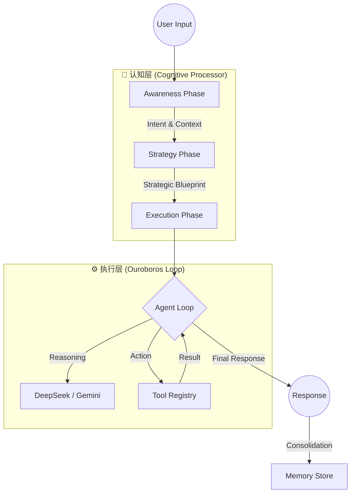

# NanoGenesis 2.2 (微创世纪)

> **"Thinking is expensive. Coding is cheap. Let's code."**

NanoGenesis 是一个**自进化、高弹性的 Linux 本地 AI Agent**。
它不是聊天机器人，而是一个**能够编写代码、操作终端、管理文件并自我修复的智能系统**。

---

## 核心架构 (Architecture)

Genesis 采用 **"Genesis Triad" (三位一体)** 认知架构，将思考与执行分离，确保每一步都精确可控。



### 1. 洞察者 (The Oracle) - Awareness Phase
- **作用**: 无论用户说什么，先识别核心意图 (Intent Recognition)。
- **机制**: 不直接回答，而是提取 `core_intent` 和 `problem_type`。
- **记忆**: 同时从 `SQLite` 中检索相关的历史记忆和知识。

### 2. 战略家 (The Strategist) - Strategy Phase
- **作用**: 在动手之前，先制定计划。
- **机制**: 结合用户的意图、历史记忆和当前工具，生成一份 **"Strategic Blueprint" (战略蓝图)**。
- **透明度**: 所有的决策逻辑都会被记录在案。

### 3. 执行者 (The Soldier) - Ouroboros Loop
- **作用**: 只负责执行，不负责空想。
- **循环**: 这是一个 **ReAct (Reason-Act)** 无限循环，直到任务完成。
    - **Step 1**: 思考 (根据蓝图)。
    - **Step 2**: 这里的 "手" (Tools) 是 **Native Python Tools**，直接操作 OS。
    - **Step 3**: 观察结果，如果报错，自动重试或修正 (Self-Correction)。
    - **Reflex**: 如果模型忘记 JSON 格式，**"Greedy Parser"** 会强制抓取代码中的指令。

---

## 关键特性 (Key Features)

### 🧠 双脑故障转移 (Bi-Directional Failover)
系统内置了两个大脑，互为备份：
1.  **Primary**: **DeepSeek V3** (通过 Native CURL 直连，绕过代理干扰)。
2.  **Backup**: **Gemini 2.5** (通过 Antigravity 协议)。
*一旦主脑通过网络失败或返回空值，系统在毫秒级内自动切换到副脑，用户无感知。*

### 💊 自愈系统 (Self-Healing)
- **Heuristic Parsing**: 即使模型输出乱码或 Markdown 代码，贪婪解析器也能提取出工具调用。
- **Memory Consolidation**: 每次对话结束后，系统会自动提炼 "Decision Insight" (决策洞察) 并存入长期记忆。

### 🔌 插件化上下文 (Context Pipeline)
不再是简单的字符串拼接。上下文由多个插件动态组装：
- `IdentityPlugin`: 身份认知。
- `TimePlugin`: 时间感知。
- `MemoryPlugin`: 长期记忆。
- `ClipBoardPlugin`: 剪贴板感知 (可扩展)。

---

## 快速运行 (Quick Start)

**直接启动 CLI**:
```bash
python3 nanogenesis/cli.py
```

**常用指令**:
- `/doctor` : 系统自检 (网络/模型/记忆)。
- `/mem` : 查看最近的记忆。
- `/clear` : 清除当前上下文 (但不清除长期记忆)。
